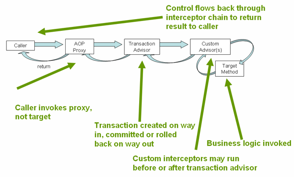

# Transactional

Аннотация @Transactional находится в пакете org.springframework.transaction.annotation
Добавление в проект:

На высоком уровне Spring создает прокси для всех классов, аннотированных с@Transactional, либо в классе, либо в любом из методов. Прокси-сервер позволяет платформе внедрять транзакционную логику до и после запущенного метода, главным образом для запуска и фиксации транзакции.
Важно иметь в виду, что если транзакционный компонент реализует интерфейс, по умолчанию прокси-сервер будет динамическим прокси-сервером Java. Это означает, что будут перехвачены только внешние вызовы методов, поступающие через прокси-сервер. Любые вызовы самовызывания не будут запускать транзакцию, даже если метод имеет аннотацию @Transactional.

Еще одно предостережение при использовании прокси заключается в том, что только публичные методы должны быть аннотированы @Transactional. Методы любой другой видимости будут просто игнорировать аннотацию молча, поскольку они не являются прокси-версиями.

Часто бизнес операция требует нескольких запросов в БД. В репозиториях же у вас очень простые и гранулярные методы типа получить сущность по идентификатору или сохранить сущность. Бизнес операция устанавливает инварианты и таким образом определяет, какие операции нужно выполнить как единое целое, то есть определяет границы транзакции. Так как реализация бизнес операции находится в сервисе, а не в репозитории, то именно метод сервиса мы и аннотируем с помощью @Transactional.

# О чем стоит помнить:

Транзанкции обладют свойствами, которые называют ACID:

- Атомарность (Atomicity) гарантирует, что никакая транзакция не будет зафиксирована в системе частично. Будут либо выполнены все операции, либо ни одной.

- Согласованность (Consistency). Выполненая транзакция, сохраняет согласованность базы данных. Согласованность является более широким понятием, чем может показаться.

- Например, в банковской системе может существовать требование равенства суммы, списываемой с одного счёта, сумме, зачисляемой на другой. Это бизнес-правило и оно не может быть гарантировано только проверками целостности базы данных. Это поведение должны учитывать программисты при написании кода транзакций. Если какая-либо транзакция произведёт списание, но не произведёт зачисления, то система останется в некорректном состоянии и свойство согласованности будет нарушено.

- Изолированность (Isolation). Во время выполнения транзакции параллельные транзакции не должны оказывать влияние на её результат.

Изолированность обходится дорого, поэтому в реальных базах данных существуют режимы, не полностью изолирующие транзакцию. Об уровнях изоляции мы поговорим в отдельной статье.

- Устойчивость (Durability). Независимо от проблем с оборудованием, изменения, сделанные успешно завершённой транзакцией, должны остаться сохранёнными после возвращения системы в работу.

https://en.wikipedia.org/wiki/Isolation_(database_systems)
